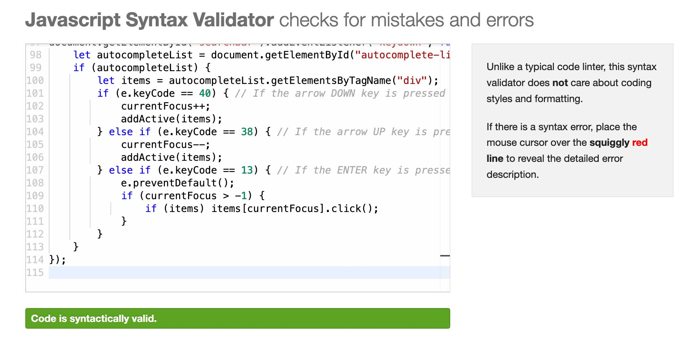
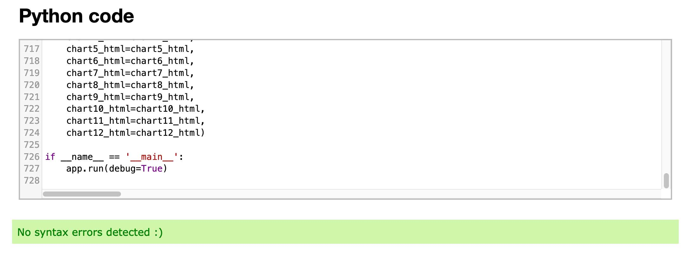

# EcoInsight Dashboard

In an era where understanding and responding to environmental challenges is paramount, the EcoInsight Dashboard serves as a critical tool for visualizing complex global data. 
By transforming the comprehensive reports of the United Nations into intuitive and interactive bar graphs, we offer a clear and accessible window into the state of our planet.
This is a Flask web application. 

 

Key Features:

- UN Data Visualization: Experience the vast repository of United Nations environmental data transformed into easy-to-understand bar graphs, highlighting key metrics and trends.

- Insightful Interpretations: Go beyond raw numbers and dive into meaningful insights drawn from global environmental reports, presented in a clear and engaging format.

- Interactive Engagement: Engage with the data through interactive elements, allowing for a personalized exploration of global environmental issues and their implications.

- Timely Updates: Stay informed with the most current data, as our dashboard regularly updates to reflect the latest findings and reports from the United Nations.

- Educational Tool: Use the dashboard as an educational resource to understand and teach others about environmental trends, challenges, and progress on a global scale.

## Features

- Navigation with links to pages, responsive on all devices.
- Compact and Sticky Navigation: As you scroll down, the navigation bar neatly shrinks and remains fixed to the top of the screen. This feature enhances the user experience by providing continuous access to the main links, 
regardless of where you are on the page. It's fully responsive, ensuring seamless functionality across all devices. 

- Efficient #id-based Navigation: Effortlessly navigate through various sections of the dashboard with our #id-based system. Each segment is thoughtfully arranged, 
offering easy access through a straightforward click. This streamlined navigation guarantees quick and efficient access to essential information, tailored for intuitive user interaction.
 
 
 
  
- Footer with social icons, link to pdf and direct link to Github.
Footer with UN Information Disclaimer, Whitepaper Link, and GitHub Repository Access.
The footer section of the page prominently displays a disclaimer regarding the source of the United Nations information, ensuring transparency and proper accreditation. 
This acknowledgement includes a direct link to the original whitepaper PDF, allowing visitors to access comprehensive details and in-depth analysis directly from the United Nations. 
Additionally, a link to a personal GitHub repository is featured, inviting users to explore the coding projects, collaborate, and contribute to ongoing developments. 
This area serves as a critical hub for resource sharing and intellectual engagement, omitting the previously mentioned social media icons and restaurant-specific information 
like address, opening hours, and contact details. The footer also reiterates the copyright information, underscoring the unique nature and ownership of the website's content.  
  

- Favicon for easy recognition.
The favicon is important in a webpage as it provides a recognizable visual identity in browser tabs, 
enhancing brand visibility and user recognition, and it helps users quickly locate and return to the site.
  
  
- Landing page 
The landing page is now designed to feature 12 interactive charts, offering a dynamic and engaging user experience. Each chart provides insights into different aspects, such as data analytics, 
and trends, based on UN data. This interactive design allows visitors to delve into various United Nations datasets, enhancing their understanding through visual representations. 
The desktop version of the charts is developed using Python's Plotly library, while the mobile version, to maintain responsiveness, uses static images.
    
    
    

- Search Bar 
Developed a search bar with predictive capabilities, enabling users to swiftly locate information. This feature organizes search results according to main themes (like energy, water, health) and sub-topics displayed on the homepage.
The predictive nature of the search bar suggests that it can anticipate the user's query, likely through algorithms that recognize patterns in user input and suggest relevant topics. The main themes like energy, water, 
and health represent broad areas of information, while the sub-topics provide more detailed categories within these areas. This organization aids in efficiently navigating and accessing specific information related to the displayed charts on the landing page.
    
    

- Interactive charts
Plotly, a graphing library is used to create interactive charts. Users have the flexibility to select a range of years between 2015 and 2022, enabling them to view data over this specific period.
Colour coding is employed for easy topic identification, with lighter shades of the same colour indicating the passage of years within each topic. This colour differentiation aids in visual distinction and understanding 
of data trends over time. The functionality to download charts as PNG files provides a convenient way to save and share visual data. 
The zoom-in/out feature enhances user interaction, allowing for a closer inspection or a broader view of the data presented in the charts.
    

- Back to the top button
A "back to top" button has been implemented to enable users to easily return to the top of the page at any time.
The button's function is to quickly take the user back to the top of the webpage, no matter where they are on the page. This feature is particularly useful for long webpages, as it saves the user from having to scroll manually all the way back to the top. It enhances the user experience by providing a convenient and time-saving way to access the top of the page, often where key navigation elements or important information is located.
    
  

## Existing Features

**Existing features:**
- Implemented a JavaScript feature that causes the navigation bar to shrink as the user scrolls down the page
- Integrated a JavaScript feature for predictive search functionality
- Implemented a JavaScript-based button to facilitate returning to the top of the page
- Developed the entire dataset using Plotly, Flask, and Python

## Technologies

The EcoInsight Dashboard website utilizes the following technologies:

- Figma for design.
- FontAwesome for icons.
- CSS for styling.
- HTML for content.
- JavaScript
- Flask as the framework.
- Python 3
- Visual Studio Code for development.
- GitHub for version control.
- ChatGPT for content creation.

Flask:
    
    

HTML:
     

JS:
         

## Validations

Autocomplete JS:
       

Navigation JS:    
       

Flask app:    
       
    

## Testing

The website has been thoroughly tested on various devices and browsers:

- Mobile (iPhone 14)
- Smaller laptop MacBook Air
- iMac
- Chrome
- Firefox
- Safari

## Credits

- Written content by ChatGPT
- Iconography [here](https://fontawesome.com/v4/icons/)
- Data: The information presented on this website has been sourced from The Sustainable Development Goals Report 2023,
as published by the United Nations.

